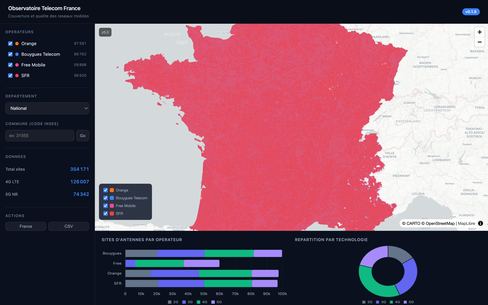

# Observatoire Telecom France

Observatoire open-source de la couverture et de la qualite des reseaux mobiles en France, alimente par les donnees ouvertes de l'ARCEP et de l'ANFR.



## Fonctionnalites

- **Carte interactive** des couvertures 4G (Orange, Bouygues, Free, SFR) avec vector tiles et zoom progressif
- **354 000 sites d'antennes** ANFR affiches par operateur et technologie (2G/3G/4G/5G)
- **API REST** documentee (FastAPI + OpenAPI) pour interroger les donnees
- **Serveur MCP** pour interroger les donnees en langage naturel via Claude
- **Agent d'analyse** multi-step (hub-and-spoke) avec pydantic-ai

## Stack technique

| Composant | Technologie |
|-----------|-------------|
| Backend | Python 3.12+, FastAPI, uv |
| Base de donnees | DuckDB + extension spatial |
| Carte | MapLibre GL JS + PMTiles (vector tiles) |
| Tuiles | Tippecanoe |
| Graphiques | Chart.js |
| MCP | SDK Python officiel (FastMCP) |
| Agent IA | pydantic-ai + Anthropic SDK |
| CI/CD | GitHub Actions |
| Deploiement | Docker + Cloudflare Tunnel |

## Demarrage rapide

### Prerequis

- Python 3.12+
- [uv](https://docs.astral.sh/uv/) (gestionnaire de paquets)
- [p7zip](https://www.7-zip.org/) (`brew install p7zip`)
- [Tippecanoe](https://github.com/felt/tippecanoe) (`brew install tippecanoe`)

### Installation

```bash
git clone https://github.com/your-username/observatoire-telecom.git
cd observatoire-telecom
uv sync
cp .env.example .env
```

### Ingestion des donnees

```bash
# Telecharger et charger les donnees ARCEP (couverture 4G, ~1 GB)
uv run python scripts/run_full_pipeline.py orange bouygues free sfr

# Generer les vector tiles
uv run python scripts/generate_tiles.py
```

### Lancer l'application

```bash
make serve
# Ouvrir http://localhost:8000
```

### Commandes utiles

```bash
make test     # Lancer les tests (pytest, 34 tests)
make lint     # Verifier le code (ruff + mypy)
make format   # Formater le code
make mcp      # Lancer le serveur MCP
make pipeline # Pipeline complete (download + load + tiles)
make seed     # Generer des donnees de test (sans telechargement)
make tiles    # Regenerer les vector tiles PMTiles
```

## API

Documentation interactive disponible sur `/docs` (Swagger UI).

| Endpoint | Description |
|----------|-------------|
| `GET /health` | Health check |
| `GET /api/v1/coverage/geojson` | Polygones de couverture (GeoJSON) |
| `GET /api/v1/coverage/commune/{code}` | Couverture par commune |
| `GET /api/v1/antennas/` | Sites d'antennes (pagine, filtrable) |
| `GET /api/v1/antennas/stats` | Stats par operateur/techno |
| `GET /api/v1/antennas/department/{code}` | Stats par departement |
| `GET /api/v1/antennas/commune/{code}` | Resume antennes d'une commune |
| `GET /api/v1/antennas/nearby` | Antennes proches (lat/lon/radius) |
| `GET /api/v1/antennas/export.csv` | Export CSV avec filtres |
| `GET /api/v1/stats/departments` | Liste des departements |
| `GET /api/v1/stats/coverage` | Stats couverture ARCEP |
| `GET /api/v1/stats/antennas` | Stats antennes nationales |
| `GET /api/v1/stats/tables` | Comptage par table |

## Sources de donnees

| Source | Type | Licence |
|--------|------|---------|
| [ARCEP - Mon Reseau Mobile](https://data.arcep.fr/mobile/) | Couverture theorique 4G (GeoPackage) | Licence Ouverte |
| [ANFR - Installations radioelectriques](https://www.data.gouv.fr/fr/datasets/551d4ff3c751df55da0cd89f/) | Sites d'antennes (CSV) | Licence Ouverte |

## Serveur MCP (Claude Desktop / Claude Code)

Le serveur MCP permet d'interroger les donnees telecom en langage naturel via Claude.

**Configurer dans Claude Desktop** (`~/Library/Application Support/Claude/claude_desktop_config.json`) :

```json
{
  "mcpServers": {
    "observatoire-telecom": {
      "command": "uv",
      "args": [
        "--directory", "/chemin/vers/observatoire-telecom",
        "run", "python", "-m", "observatoire.mcp"
      ]
    }
  }
}
```

**Tools disponibles :**

| Tool | Description |
|------|-------------|
| `get_antenna_count` | Antennes par operateur pour une commune ou national |
| `compare_operators` | Classement operateurs par nombre de sites |
| `get_coverage_summary` | Resume des donnees disponibles |
| `search_antennas` | Recherche d'antennes dans une commune avec GPS |

## Architecture

```
Sources (ARCEP/ANFR)
    |
    v
Pipeline d'ingestion (httpx, 7z, DuckDB ST_Read)
    |
    v
DuckDB (extension spatial, Lambert-93)
    |
    +---> FastAPI REST API ---> Frontend (MapLibre + Chart.js)
    +---> Serveur MCP -------> Claude Desktop / Claude Code
    +---> Agent Claude ------> Rapports d'analyse
```

## Licence

MIT
